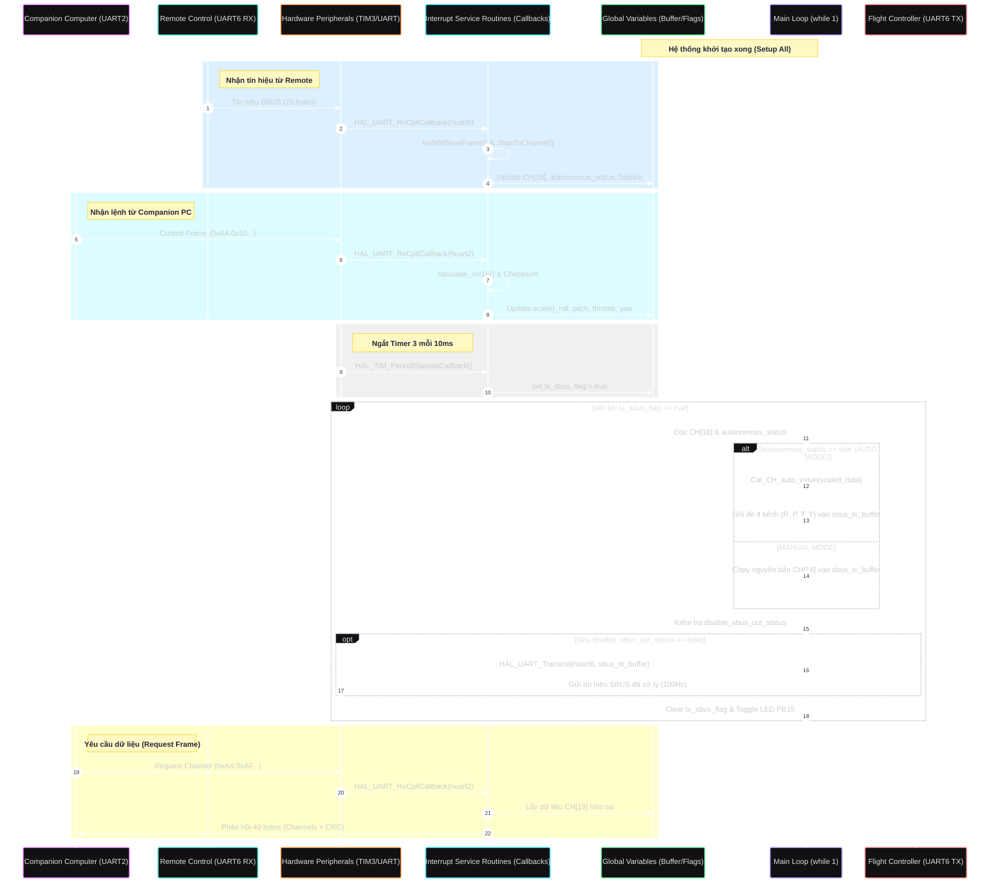

## System Architecture

```mermaid
---
config:
    theme: redux-dark-color
---
sequenceDiagram
    autonumber
    participant PC as Companion Computer (UART2)
    participant RC as Remote Control (UART6 RX)
    participant HW as Hardware Peripherals (TIM3/UART)
    participant ISR as Interrupt Service Routines (Callbacks)
    participant Globals as Global Variables (Buffer/Flags)
    participant Main as Main Loop (while 1)
    participant Drone as Flight Controller (UART6 TX)

    Note over Main, Globals: Hệ thống khởi tạo xong (Setup All)

    %% LUỒNG NGẮT NHẬN DỮ LIỆU
    rect rgb(220, 240, 255)
    Note right of RC: Nhận tín hiệu từ Remote
    RC->>HW: Tín hiệu SBUS (25 bytes)
    HW->>ISR: HAL_UART_RxCpltCallback(huart6)
    ISR->>ISR: IsValidSbusFrame() & SbusToChannel()
    ISR->>Globals: Update CH[18], autonomous_status, failsafe
    end

    rect rgba(220, 252, 255, 1)
    Note right of PC: Nhận lệnh từ Companion PC
    PC->>HW: Control Frame (0xAA 0x55...)
    HW->>ISR: HAL_UART_RxCpltCallback(huart2)
    ISR->>ISR: calculate_crc16() & Checksum
    ISR->>Globals: Update scaled_roll, pitch, throttle, yaw
    end

    %% LUỒNG ĐIỀU KHIỂN CHU KỲ
    rect rgba(240, 240, 240, 0.94)
    Note right of HW: Ngắt Timer 3 mỗi 10ms
    HW->>ISR: HAL_TIM_PeriodElapsedCallback()
    ISR->>Globals: set tx_sbus_flag = true
    end

    loop Mỗi khi tx_sbus_flag == true
        Main->>Globals: Đọc CH[18] & autonomous_status
        
        alt autonomous_status == true (AUTO MODE)
            Main->>Main: Cal_CH_auto_value(scaled_data)
            Main->>Main: Ghi đè 4 kênh (R, P, T, Y) vào sbus_tx_buffer
        else MANUAL MODE
            Main->>Main: Copy nguyên bản CH[18] vào sbus_tx_buffer
        end

        Main->>Globals: Kiểm tra disable_sbus_out_status
        
        opt Nếu disable_sbus_out_status == false
            Main->>HW: HAL_UART_Transmit(huart6, sbus_tx_buffer)
            HW->>Drone: Gửi tín hiệu SBUS đã xử lý (100Hz)
        end
        
        Main->>Globals: Clear tx_sbus_flag & Toggle LED PB15
    end

    %% LUỒNG PHẢN HỒI PC
    rect rgb(255, 255, 204)
    Note right of PC: Yêu cầu dữ liệu (Request Frame)
    PC->>HW: Request Channel (0xAA 0xAF...)
    HW->>ISR: HAL_UART_RxCpltCallback(huart2)
    ISR->>Globals: Lấy dữ liệu CH[18] hiện tại
    ISR->>PC: Phản hồi 40 bytes (Channels + CRC)
    end
```