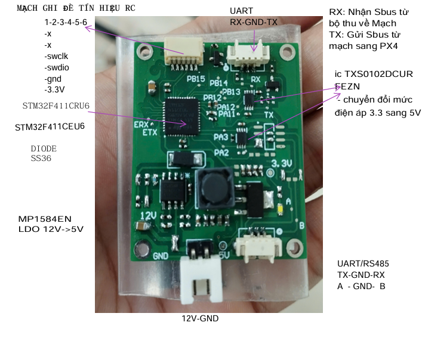

# Mạch ghi đè RC
mạch ghi đè tín hiệu RC từ SBUS

## Chức năng
- đọc tín hiệu Sbus_in, giải thành tín hiệu rc_channels
- nhận tín hiệu rc_auto_control gửi từ UART, chuyển thành SBUS_out
- xuất dữ liệu giá trị của 18 rc_channels
- Giả lập ngắt tín hiệu SBUS_out
## Thông số kĩ thuật
- Nguồn DC 12-18V
- cổng SBUS: 3 pin: SBUS_in - GND - SBUS_out
- cổng UART: 3 pin (RX - GND - TX)
- cổng Debug: 6 pin (nạp st-link) : 3.3V - GND - SWDIO - SWCLK - RESET - ...
## HDSD:
- Mục đích của tập tin này là để kiểm tra việc gửi 
lệnh RC và nhận phản hồi từ bộ điều khiển RC thông qua cổng serial.
- Sử dụng thư viện serial_asyncio để thực hiện các thao tác bất đồng 
bộ với cổng serial.
- Chạy tập tin này để kết nối tới cổng RC, gửi lệnh và nhận dữ liệu RC channels.
- Có thể điều chỉnh các giá trị RC (pitch, roll, throttle, yaw) trong 
hàm main để kiểm tra các lệnh khác nhau
- Có thể thay đổi TIME_DELAY để điều chỉnh thời gian chờ giữa các lệnh.
- Nhấn Ctrl+C để dừng chương trình.
## Mode: RC_control
- Tay điều khiển SIYI MK15
    1. Chế độ Auto RC_control pitch, roll, throttle, yaw
        - Đồng thời: Gạt Switch bên phải sang nấc dưới cùng + nhấn Button A sáng đèn
    2. Chế độ Manual RC_control pitch, roll, throttle, yaw
        - Một trong hai, hoặc cả hai: Gạt Switch bên phải sang nấc giữa/ trên cùng / nhấn Button A tắt đèn
    3. Chế độ Ngắt gửi Sbus_out vào Px4
        - Nhấn Button B sáng đèn
    4. Chế độ gửi Sbus_out vào Px4
        - Nhấn Button B tắt đèn 
## Note:
- Đảm bảo rằng cổng serial được kết nối đúng và thiết bị đã sẵn sàng nhận lệnh.
- Lưu ý rằng cổng serial và baudrate cần được cấu hình đúng với thiết bị của bạn
- Thời gian chờ giữa các lệnh có thể điều chỉnh thông qua biến TIME_DELAY.
- Nếu gặp lỗi kết nối, hãy kiểm tra lại cổng serial và thiết bị.
- Đảm bảo rằng thư viện crc đã được cài đặt để tính toán CRC16.

